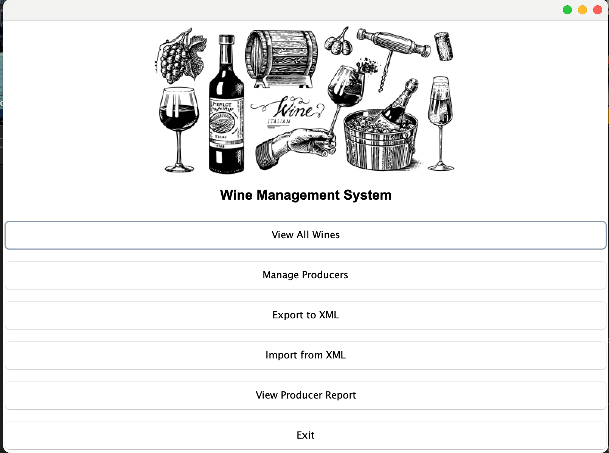
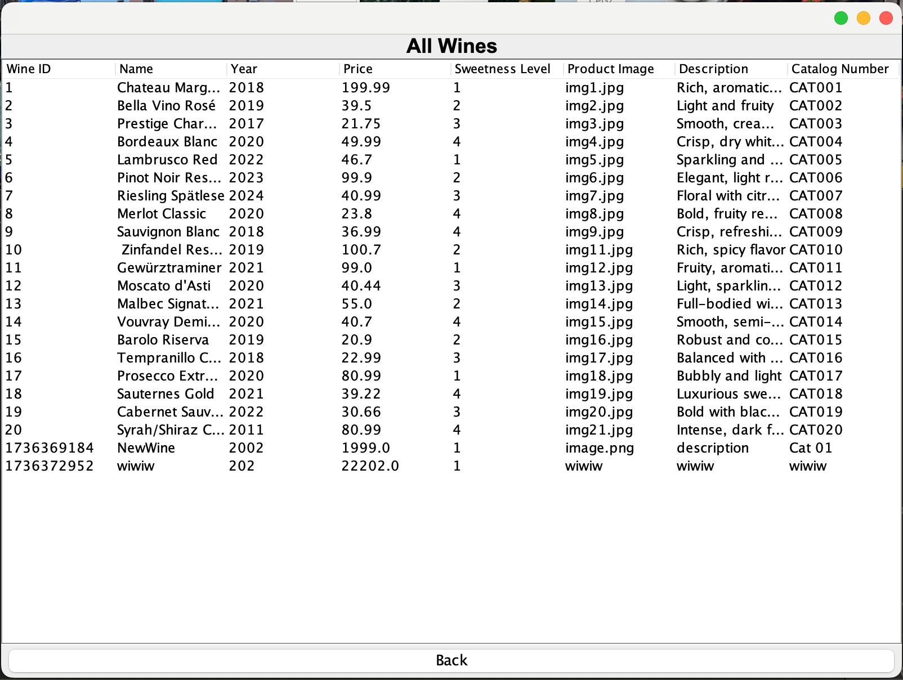
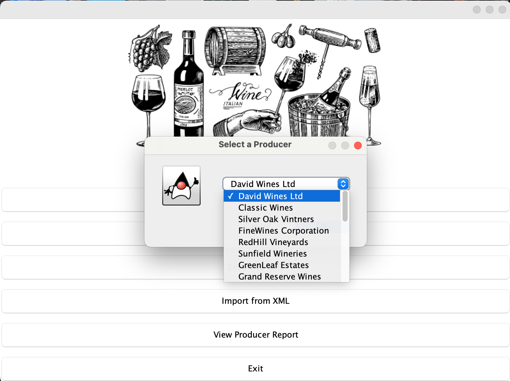
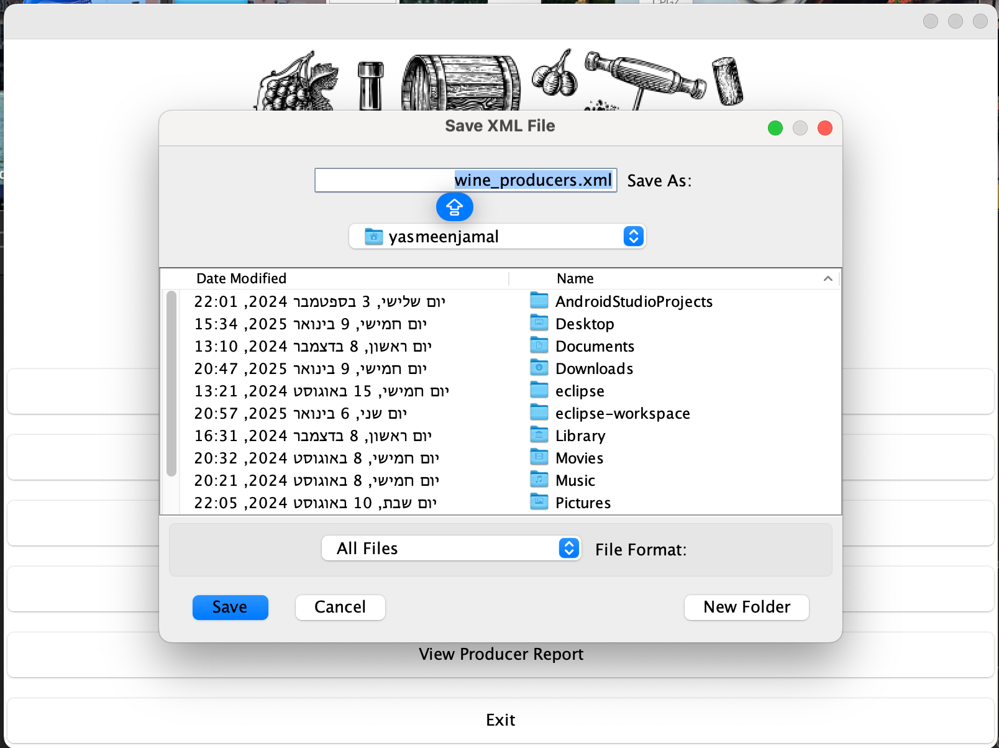
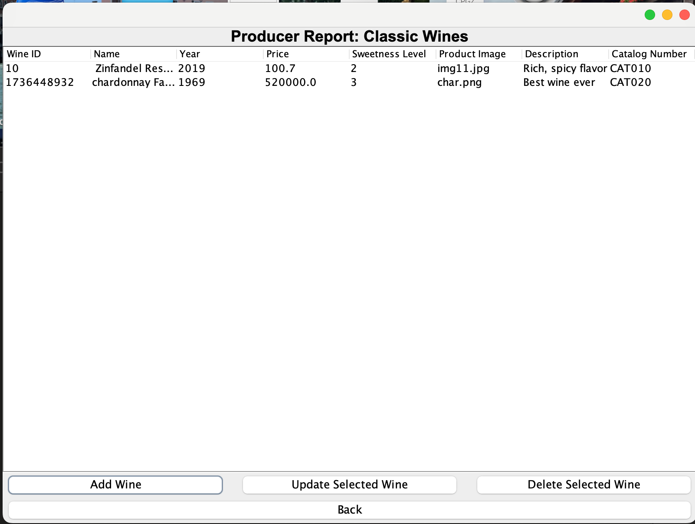

# Wine Management System

## Overview
The **Wine Management System** is a Java-based application designed to manage wines and producers efficiently. This tool allows users to:

- View all wines in the database.
- Manage wine producers.
- Export and import data in XML format.
- Generate detailed producer reports.

The project is part of the Cheer-System initiative, with a user-friendly interface and robust features for wine inventory management.

## Features

   

1. **View All Wines**
   - Displays a table of all wines with details such as:
     - Wine ID
     - Name
     - Year
     - Price
     - Sweetness Level
     - Product Image
     - Description
     - Catalog Number

   - Example:

     

2. **Manage Producers**
   - Add, update, or delete producers from the system.
   - View wine details for selected producers.

   - Example of producer selection:

     

3. **Export to XML**
   - Save wine and producer data in XML format.

   - Example:

     

4. **Import from XML**
   - Load data from an XML file to the application.

5. **View Producer Report**
   - Generate a detailed report for a selected producer, showing all their wines and relevant details.

   - Example:

     

## Usage

1. Launch the application.
2. Navigate through the main menu to:
   - View wines
   - Manage producers
   - Export or import data
   - View reports
3. Follow on-screen instructions for specific actions.